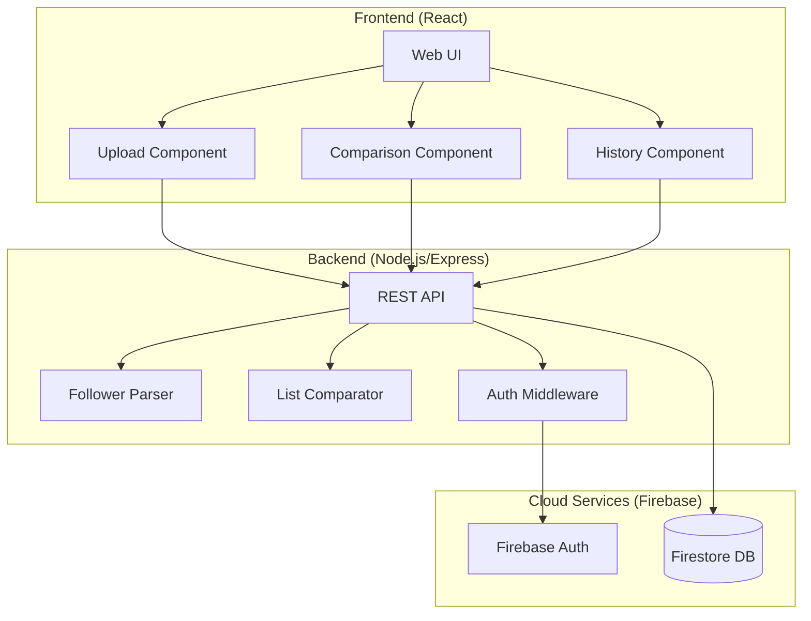

# Design Document

## Overview

Instagram Follower Tracker, kullanıcıların Instagram API'si kullanmadan takipçi listelerini manuel olarak yükleyip bulutta saklayabilecekleri ve zaman içindeki değişiklikleri takip edebilecekleri bir web uygulamasıdır. Uygulama React frontend, Node.js/Express backend ve Firebase (Firestore + Authentication) kullanarak geliştirilecektir.

## Architecture



## Components and Interfaces

### Frontend Components

#### 1. UploadComponent
- Dosya yükleme (drag & drop destekli)
- Metin alanına yapıştırma
- Yükleme durumu göstergesi

#### 2. ComparisonComponent
- Yeni takipçiler listesi
- Takipten çıkanlar listesi
- Özet istatistikler

#### 3. HistoryComponent
- Snapshot listesi (tarih sıralı)
- Snapshot seçimi
- Silme işlemleri

#### 4. AuthComponent
- Giriş/Kayıt formları
- Oturum yönetimi

### Backend Services

#### 1. FollowerParser Service
```typescript
interface FollowerParser {
  parse(input: string): string[];
  parseFile(fileContent: string): string[];
  validateUsername(username: string): boolean;
}
```

#### 2. ListComparator Service
```typescript
interface ComparisonResult {
  newFollowers: string[];
  unfollowers: string[];
  timestamp: Date;
  oldSnapshotId: string;
  newSnapshotId: string;
}

interface ListComparator {
  compare(oldList: string[], newList: string[]): ComparisonResult;
}
```

#### 3. SnapshotRepository
```typescript
interface Snapshot {
  id: string;
  userId: string;
  followers: string[];
  followerCount: number;
  createdAt: Date;
}

interface SnapshotRepository {
  create(userId: string, followers: string[]): Promise<Snapshot>;
  getById(id: string): Promise<Snapshot | null>;
  getAllByUser(userId: string): Promise<Snapshot[]>;
  delete(id: string): Promise<void>;
  deleteAllByUser(userId: string): Promise<void>;
}
```

### API Endpoints

| Method | Endpoint | Description |
|--------|----------|-------------|
| POST | /api/snapshots | Yeni snapshot oluştur |
| GET | /api/snapshots | Kullanıcının tüm snapshot'larını getir |
| GET | /api/snapshots/:id | Belirli snapshot'ı getir |
| DELETE | /api/snapshots/:id | Snapshot sil |
| DELETE | /api/snapshots | Tüm snapshot'ları sil |
| POST | /api/compare | İki snapshot'ı karşılaştır |

## Data Models

### Snapshot Model
```typescript
interface Snapshot {
  id: string;
  userId: string;
  followers: string[];
  followerCount: number;
  createdAt: Timestamp;
}
```

### ComparisonResult Model
```typescript
interface ComparisonResult {
  newFollowers: string[];
  unfollowers: string[];
  oldSnapshot: {
    id: string;
    createdAt: Date;
    followerCount: number;
  };
  newSnapshot: {
    id: string;
    createdAt: Date;
    followerCount: number;
  };
}
```

### User Model (Firebase Auth)
```typescript
interface User {
  uid: string;
  email: string;
  displayName?: string;
}
```


## Correctness Properties

*A property is a characteristic or behavior that should hold true across all valid executions of a system-essentially, a formal statement about what the system should do. Properties serve as the bridge between human-readable specifications and machine-verifiable correctness guarantees.*

### Property 1: Parsing extracts all valid usernames
*For any* input string containing a mix of valid Instagram usernames and other content, parsing the input SHALL extract exactly all valid usernames (matching Instagram username rules: alphanumeric, underscores, periods, 1-30 characters).
**Validates: Requirements 1.1, 1.2**

### Property 2: Invalid entries are filtered
*For any* input containing invalid entries (empty lines, special characters, too long strings), the parser SHALL return a list containing only valid usernames with all invalid entries removed.
**Validates: Requirements 1.3**

### Property 3: Count matches parsed list length
*For any* successfully parsed follower list, the reported follower count SHALL equal the length of the parsed username array.
**Validates: Requirements 1.4**

### Property 4: Snapshot serialization round-trip
*For any* valid Snapshot object, serializing to JSON and then deserializing SHALL produce an object equivalent to the original snapshot (same userId, followers array, followerCount, and createdAt).
**Validates: Requirements 2.4, 2.5**

### Property 5: New followers identification
*For any* two follower lists (oldList and newList), the set of new followers SHALL equal the set difference (newList - oldList), containing exactly those usernames present in newList but absent in oldList.
**Validates: Requirements 3.2**

### Property 6: Unfollowers identification
*For any* two follower lists (oldList and newList), the set of unfollowers SHALL equal the set difference (oldList - newList), containing exactly those usernames present in oldList but absent in newList.
**Validates: Requirements 3.3**

### Property 7: Comparison symmetry
*For any* two follower lists A and B, if comparing A→B identifies username X as an unfollower, then comparing B→A SHALL identify X as a new follower, and vice versa.
**Validates: Requirements 3.2, 3.3**

### Property 8: Alphabetical sorting correctness
*For any* list of usernames, sorting alphabetically SHALL produce a list where each element is lexicographically less than or equal to the next element.
**Validates: Requirements 6.3**

### Property 9: Snapshot deletion removes from storage
*For any* snapshot that is deleted, subsequent retrieval attempts for that snapshot SHALL return null/not found.
**Validates: Requirements 7.1, 7.2**

### Property 10: Delete all removes all user snapshots
*For any* user with N snapshots (N > 0), after executing delete all, the user's snapshot count SHALL be zero.
**Validates: Requirements 7.3**

## Error Handling

### Frontend Error Handling
| Error Type | Handling Strategy |
|------------|-------------------|
| File upload failure | Display error message, allow retry |
| Invalid file format | Show format requirements, reject file |
| Network error | Show offline indicator, queue for retry |
| Authentication error | Redirect to login page |
| Empty input | Show validation message |

### Backend Error Handling
| Error Type | HTTP Status | Response |
|------------|-------------|----------|
| Invalid input | 400 | `{ error: "Invalid input format" }` |
| Unauthorized | 401 | `{ error: "Authentication required" }` |
| Snapshot not found | 404 | `{ error: "Snapshot not found" }` |
| Server error | 500 | `{ error: "Internal server error" }` |

### Validation Rules
- Username: 1-30 characters, alphanumeric + underscore + period
- File size: Maximum 5MB
- Follower count per snapshot: Maximum 100,000

## Testing Strategy

### Unit Testing
Unit tests will verify specific examples and edge cases:
- Parser with various input formats (newline, comma, space separated)
- Username validation edge cases
- Empty input handling
- Comparison with empty lists
- Snapshot CRUD operations

### Property-Based Testing
Property-based tests will use **fast-check** library for TypeScript/JavaScript to verify universal properties across random inputs.

**Configuration:**
- Minimum 100 iterations per property test
- Each test tagged with: `**Feature: instagram-follower-tracker, Property {number}: {property_text}**`

**Properties to test:**
1. Parsing correctness (Property 1, 2, 3)
2. Serialization round-trip (Property 4)
3. Set difference operations (Property 5, 6, 7)
4. Sorting correctness (Property 8)
5. Deletion behavior (Property 9, 10)

### Integration Testing
- End-to-end upload and comparison flow
- Authentication flow
- Multi-snapshot comparison scenarios

### Test File Structure
```
src/
├── services/
│   ├── followerParser.ts
│   ├── followerParser.test.ts
│   ├── listComparator.ts
│   ├── listComparator.test.ts
│   └── listComparator.property.test.ts
├── repositories/
│   ├── snapshotRepository.ts
│   └── snapshotRepository.test.ts
└── models/
    ├── snapshot.ts
    └── snapshot.property.test.ts
```
